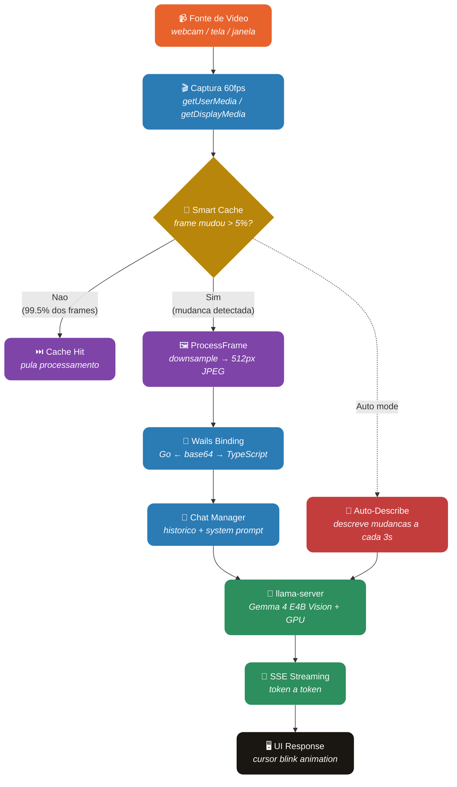

<div align="center">

# VisionChat

**Converse com uma IA sobre o que ela ve em tempo real — webcam, tela ou janela.**

[](https://go.dev)
[](https://wails.io)
[](https://github.com/ggml-org/llama.cpp)
[](https://go.dev)
[](#license)

[Features](#-features) · [Como Funciona](#-como-funciona) · [Performance](#-performance) · [Tech Stack](#-tech-stack) · [Desenvolvimento](#-desenvolvimento)

</div>

---

## O que e o VisionChat?

VisionChat e um app desktop que captura video em tempo real (webcam, tela ou janela) e permite conversar com uma IA de visao sobre o que ela esta vendo. Pergunte sobre objetos, peca para descrever a cena, ou ative o modo auto-describe para narracoes continuas.

**Tudo roda localmente na sua GPU.** O modelo de visao (Gemma 4 E4B) roda via llama.cpp com aceleracao Vulkan/CUDA. Nenhum dado sai do seu computador.

---

## Features

| Categoria | O que voce ganha |
|---|---|
| **3 Fontes de Video** | Webcam, compartilhamento de tela inteira, ou janela especifica — troque a qualquer momento |
| **Chat com Visao** | Envie mensagens com o frame atual anexado — a IA descreve e responde sobre o que ve |
| **Streaming Token a Token** | Respostas aparecem em tempo real com cursor piscante, sem esperar a resposta completa |
| **Smart Frame Cache** | Inspirado na visao humana: so processa frames quando ha mudanca significativa (99.5% economia) |
| **Auto-Describe Mode** | A IA descreve automaticamente mudancas na cena a cada 3 segundos |
| **Motion Detection** | LED indicador pulsa quando detecta movimento no video |
| **Adaptive Frame Rate** | Cena estatica → intervalo sobe ate 500ms; movimento → volta a 16ms (60fps) |
| **HUD de Telemetria** | FPS, cache hit rate, intervalo adaptativo — tudo visivel em tempo real |
| **Conversa Multi-Turn** | Historico de conversa mantido com max 20 pares (evita overflow de contexto com imagens) |
| **Keyboard Shortcuts** | Ctrl+1/2/3 trocar fonte, Ctrl+Shift+A auto-describe, Ctrl+Shift+F anexar frame, Enter enviar |
| **100% Local** | Modelo roda na GPU via llama.cpp — zero cloud, zero latencia de rede, privacidade total |
| **48 Testes** | 42 unitarios + 6 integracao com modelo real — todos passando |

---

## Como Funciona



### Smart Frame Cache (Visao Humana)

O olho humano enxerga tudo, mas so renderiza o que esta em foco ou em movimento. O VisionChat funciona igual:

- Frames sao **downsampled para 64x64** e comparados por luminancia — O(n) rapido
- Se a diferenca for **< 5%**, o frame e ignorado (cache hit)
- Se houver mudanca significativa, o frame e processado e enviado ao modelo
- O intervalo de analise se **adapta automaticamente**: cena estatica → 500ms, movimento → 16ms

Resultado: **99.5% dos frames sao ignorados** em cenas tipicas, sem perder nenhuma mudanca relevante.

---

## Performance

Benchmarks reais rodando na RTX 4070 (12GB VRAM) com Gemma 4 E4B Vision:

| Metrica | Resultado |
|---|---|
| **Text latency** | 114ms |
| **Vision latency** | 328ms |
| **Streaming first token** | 53ms |
| **Streaming throughput** | 108.9 tokens/sec |
| **Frame processing** | 21 fps (1920x1080 → 512px) |
| **Cache analysis** | 78 fps |
| **Cache hit rate** | 99.5% (cena tipica) |
| **VRAM usage** | ~3.4GB / 12GB |

---

## Tech Stack

| Camada | Tecnologia |
|---|---|
| **Desktop Framework** | Wails 2.11 (Go + WebView2) |
| **Backend** | Go 1.25 |
| **Frontend** | TypeScript + Vite |
| **AI Model** | Gemma 4 E4B IT Vision (GGUF Q8_0) |
| **Inference** | llama.cpp b8664 (Vulkan GPU) |
| **Video Capture** | getUserMedia + getDisplayMedia (Web APIs) |
| **Unit Tests** | Go testing + httptest |
| **Integration Tests** | Go testing com modelo real |

---

## Desenvolvimento

### Pre-requisitos

- Go 1.25+
- Wails CLI (`go install github.com/wailsapp/wails/v2/cmd/wails@latest`)
- Node.js 18+
- GPU NVIDIA com 8GB+ VRAM (recomendado: RTX 3060+)

### Setup

```bash
# Clone
git clone https://github.com/JohnPitter/vision-chat.git
cd vision-chat

# Baixar llama.cpp (binarios pre-compilados)
mkdir -p ~/.cache/models/llama-cpp
curl -L -o /tmp/llama.zip https://github.com/ggml-org/llama.cpp/releases/download/b8664/llama-b8664-bin-win-vulkan-x64.zip
unzip /tmp/llama.zip -d ~/.cache/models/llama-cpp/

# Iniciar llama-server (baixa o modelo automaticamente ~2.3GB)
~/.cache/models/llama-cpp/llama-server -hf ggml-org/gemma-4-E4B-it-GGUF:Q8_0 -ngl 99 --port 8090 --flash-attn on

# Em outro terminal: build e rodar
wails build
./build/bin/vision-chat.exe

# Ou modo dev com hot reload
wails dev
```

### Testes

```bash
# Testes unitarios (42 testes)
go test ./... -count=1

# Testes de integracao (requer llama-server rodando)
go test -tags integration -run TestIntegration -v -timeout 300s

# Testes E2E com simulacao de usuario (requer llama-server rodando)
go test -tags integration -run TestE2E -v -timeout 600s
```

### Estrutura

```
vision-chat/
  llama/
    types.go          # Tipos compartilhados (ChatMessage, ServerConfig, etc.)
    client.go         # HTTP client para llama-server API
    client_test.go    # 7 testes (text, vision, health, errors, timeout)
    stream.go         # Streaming SSE client
    stream_test.go    # 4 testes (streaming, cancel, finish, errors)
    server.go         # Gerenciador de subprocess llama-server
    server_test.go    # 9 testes (config, args, state, HF repo, mmproj)
  chat/
    manager.go        # Historico de conversa com max history
    manager_test.go   # 7 testes (add, clear, vision msg, round-trip)
  vision/
    processor.go      # Resize e encode de frames (base64 JPEG)
    processor_test.go # 10 testes (validate, resize, format, empty)
    cache.go          # Smart frame cache com motion detection
    cache_test.go     # 16 testes (diff, cache, adaptive, stats)
  app.go              # Wails bindings (SendMessage, AnalyzeFrame, etc.)
  main.go             # Entry point Wails
  frontend/src/
    main.ts           # Bootstrap, wiring, keyboard shortcuts
    video.ts          # Webcam + screen + window capture (60fps)
    chat.ts           # Chat UI com streaming e frame attach
    style.css         # Dark theme com glassmorphism HUD
```

---

## Privacidade

- Modelo de IA roda 100% local na sua GPU
- Nenhum dado e enviado para servidores externos
- Video da webcam/tela e processado localmente e descartado apos analise
- Nenhum historico e salvo em disco — ao fechar o app, tudo desaparece
- Codigo fonte aberto para auditoria

---

## Roadmap

| Feature | Descricao |
|---|---|
| **Pipeline Multi-Modelo** | Usar o modelo de visao como "cerebro" que dirige outros modelos especializados localmente — similar ao que Gemma 4 + SAM 3 + RF-DETR fazem: visao entende a cena, SAM segmenta objetos, RF-DETR rastreia em tempo real |
| **Deteccao de Objetos** | Integrar RF-DETR ou YOLO para deteccao e tracking de objetos no video em tempo real, com bounding boxes visuais no feed |
| **Segmentacao com SAM** | Usar Segment Anything Model (SAM 3) para recortar e isolar objetos identificados pelo modelo de visao |
| **Modelo de Visao Maior** | Suporte a Gemma 4 ou modelos maiores quando llama.cpp adicionar suporte a novas arquiteturas |
| **Gravacao de Macros** | Gravar sequencias de acoes do agente para replay automatico |
| **Multi-Monitor** | Suporte a selecao de monitor especifico para screen capture |

---

## License

MIT License - use livremente.
